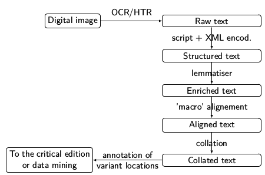

# What this tutorial is and is not

This tutorial aims to help yourself building a **text processing workflow**
that suits your need and your ressources.

It is modular, in order to be useful for a variety of:

- research goals;
- starting points;
- technical levels and resources.

It is written with, in mind, Medieval Western languages, especially
Romance and Latin, but can be more generally useful for historical languages.

This is a tutorial on building a text processing workflow, not a collection
of tutorials on each specific tool. We include short description cards for each
tool, and point to relevant exterior ressources when needed.

This is a tutorial on corpus production and text processing workflows, so, 
we will only allude to what to do with the corpus once it has been produced
(data mining, stemmatology, critical editing, etc.). Please note that this does'nt
mean that you shouldn't be very clear about your research goals when starting
to build the corpus and selecting a path.

# Before everything: selecting a path

Before selecting a path, you need to establish clearly 
the _ressources you have or are willing to invest_,
the _goals you are trying to attain_, and make a choice regarding software between, on 
one hand, **user-friendliness and ease of use** or, on the other, 
**flexibility and tailor-made**. 

The following yes/no statements are intended to help you select a starting point.
Are all of the following statements **true** in your case?

- my need are not covered by out-of-the-box tools;
- I have access to an IT infrastructure, or, at least, a Linux computer or server;
- I know at least one programming language, or someone from my team does;
- I know what an API is;
- ressources are scarce or non-existent for the language I study (models, corpora, …);
- I prefer to use only open software;
- I wish to control every aspect of the processing workflow (data model and formats, algorithms, etc.);
- I am ready to invest significant time and effort in producing this corpus.

If all these statements are false in your case, you can safely select 
**path 1, aka _the user-friendly path_**. Otherwise, you might need
to select **path 2, aka the Do-it-yourself path** \[or even **path 3, the pionneer path**\].

# Path and starting point

Orient toward a step -> where do I start ?

  - What is my goal, and what data do I expect from the output?
  - What data do I already have, if any?

For each path: where can I be lazy and where I cannot be. Ce qui est rédhibitoire / impératif. Skippable steps, unskippable steps

For each tool: ratio time-investment / improvement in the results  (difficulty)

## An example: Workflow for some ENC Projects (Geste; Lancelot)

## 1. The `user-friendly', easy to deploy, quite-not-so-modular path

### Where to start?

If you already have the digital text of your corpus, start at **2**.

If you already have structured and annotated data, start at **3**.

### Path 

1. Text acquisition with Transkribus: OCR, HTR, 
2. Text Enrichment (skippable): select one or several (or none) of the following according to your goals
  - lemmatisation with Pyrrha;
  - named entities annotation with (Recogito?);
  - …
3. Text interrogation
  - TXM
4. Text alignment: are you working on multiple-versions texts? If not, you can skip this step.
  - Tracer;
  - Iteal;
  - Stemmaweb.
5. See _common final steps_ below.

## 2. The DIY modular path

You can report to the following documents to learn more about each conceptual step,
and identify the software the more suited to your needs. For each software, 
we give a short 'software' cards, specifying installing, inputs and outpus,
existing models when relevant, and provide data samples with minimal executable code.

The goal is to help you in articulating the tools, linking and chaining them.

0. Project conception: goals, expected output, canonical data model.
1. [./01_Text_Acquisition/Text_Acquisition.md](Text Acquisition)
2. [02_Enrichment/Enrichment.md](Text Enrichment) 
3. [03_Alignment/Alignment.md](Text Alignment and Collation)
4. See _common final steps_ below.

## 3. The `pioneer' path: for low-ressources, 'build every model yourself from your data', cases.

Starting from scratch: data, models, etc.

## Common final steps

What data are useful ? In what ?

Robinson's main stages of digital critical edition: transcription, collation, stemmatological analysis, edition, publication.

- juridic questions
- How do I preserve the data ?
- License
- Archiving
- edition / publishing

